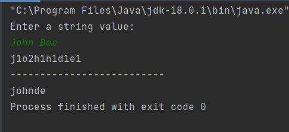
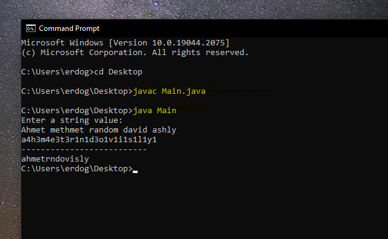

# Java Backend Bootcamp Assignment 2

I have to get the string from the user(console) and then I have to print the numbers of characters of the string with the character in order.

**I provide the different approaches to solve this problem. So You will see the solution with HashMap and HashSet with List structure.**

You can see the example below:

| Entered String | Desired output  1  | Desired output  2 |
|----------------|--------------------|-------------------|
| Recep Tayyip   | r1e2c1p2t1a1y2i1   | recptayi          |
| John Doe       | j1o2h1n1d1e1       | johnde            |

You can see the steps below for how you can compile my code on your machine.



If you want to compile my source code in your computer, you can use this command:

``` javac SolutionWithHashSet.java ```

``` java SolutionWithHashSet ```

You can see the SS of compiling and running my code below:


