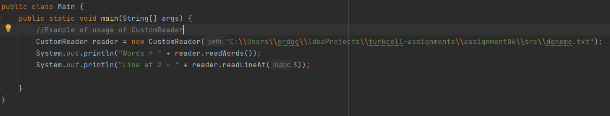

# Java Backend Bootcamp Assignment 6

**I implemented *Special File Reader* In this assignment, If you give a file 
path of any text file to CustomReader class's constructor, You will see 
different 
methods that implemented by me. These methods have special function, you can 
see examples below.**

## Example
### If you have a txt file like below: You can use two different method after creating CustomReader's instance and passed text file path as a parameter to constructor, and you can see the expected output from table.
```
Lorem ipsum dolor sit amet, consectetur adipiscing elit. Sed suscipit dolor ante, vitae porttitor odio semper nec. Cras at consectetur urna. Mauris ac malesuada tortor. Phasellus fringilla sed leo et ultrices. Fusce pretium lacinia diam, id laoreet orci rutrum a. Sed gravida convallis rhoncus. Donec mi ipsum, iaculis non lorem et, tincidunt ullamcorper est. Nunc vehicula libero nunc, et cursus diam euismod sit amet. Donec in nisl sit amet nulla congue finibus egestas ac diam. Pellentesque habitant morbi tristique senectus et netus et malesuada fames ac turpis egestas. Duis vel dolor eros. Duis feugiat mattis lorem id auctor.

Aenean commodo massa vel gravida vestibulum. Duis vitae iaculis justo. Proin tristique ut ex vitae suscipit. Cras non ante gravida, eleifend est ut, tempus nulla. Nulla et justo urna. Fusce tempor vel metus nec aliquet. Donec dapibus metus libero. Ut sagittis enim ut arcu ultricies, non varius mauris vestibulum. Cras pulvinar, diam vitae commodo dignissim, lorem dolor congue erat, sed fringilla nunc urna ac nisl. Praesent fringilla justo quis posuere vulputate.

Sed felis orci, egestas non justo vel, commodo dignissim purus. Nulla porttitor imperdiet lectus ultrices maximus. Donec congue lacus lorem. Aenean facilisis, ipsum nec gravida vehicula, sapien purus finibus felis, in efficitur lacus orci placerat leo. In at erat ut felis blandit molestie. Nullam nec gravida arcu, vehicula aliquet erat. Pellentesque pellentesque semper nibh, eu mattis odio. Maecenas bibendum tincidunt malesuada. Aenean venenatis lectus et hendrerit dignissim. Vivamus tempus vel velit sed accumsan. Duis lobortis turpis vel leo vulputate, et dapibus tortor interdum. Pellentesque a pulvinar ipsum. Nunc iaculis nec mi non lacinia. Nulla tristique, felis ac varius pretium, sem eros facilisis magna, tincidunt condimentum elit neque vulputate dolor.

```
**WARNING:** Above text file has 6 lines (count empty lines), but you can use 
any text 
file that you want. 

| Method                | Output                                                          |
|-----------------------|-----------------------------------------------------------------|
| **readWords**         | [ **Lorem**, **ipsum**, **dolor**, **sit**, **amet**, **consectetur**, **adipiscing**, ...] |
| **readLineAt( 5 )**   | sed felis orci, egestas non justo vel, ..........               |


The Following images describes the usage of CustomReader class.


